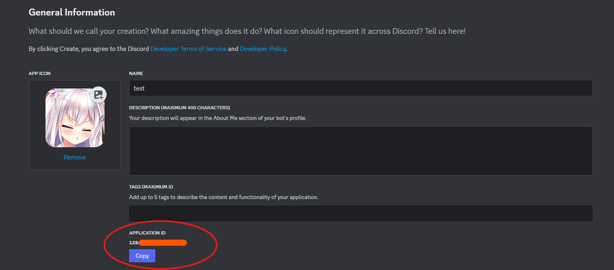
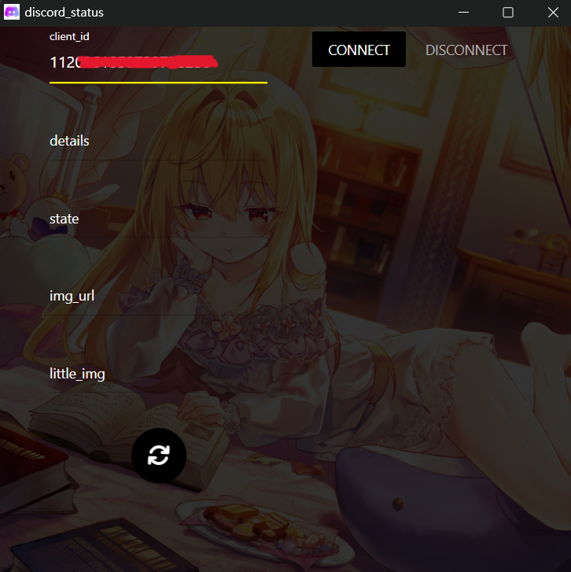
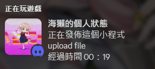

<h1 align="center">discord-status: change your rich presence</h1>
<p>
  <a href="https://github.com/peter910820/discord-status/blob/main/LICENSE" target="_blank">
    
  </a>
  <a href="https://twitter.com/seaotterMS" target="_blank">
    
  </a>
</p>

> Use discord rpc to change your rich presence 
## :gear: How to use 
  1. download the release and unzip
  2. go to [discord developer](https://discord.com/developers/applications) register an application.
  
  3. fill into "client_id" field and press **CONNECT** button.
  
  4. Fill in other information and press circle button. img can only fill in **.jpg**, **.png** or **.gif** of https. 
  5. If you want to update, just press the circle button.
  6. To close application, please remember to press **DISCONNECT** button first. 

## :wrench: Build 
1. clone this repositories 
```bash
git clone https://github.com/peter910820/discord-status.git
``` 
2. download python and install package 
```bash
pip install -r requirements.txt
``` 
3. execution **app.py** 
```bash
python app.py
``` 

## :star: Achievements 

## :bust_in_silhouette: Author 
:orange_heart:  **SeaotterMS** 
* Twitter: [@seaotterMS](https://twitter.com/seaotterMS)
* Github: [@peter910820](https://github.com/peter910820) 

## :scroll: TODO 
* Add recommended GIFs and display images. 

## 🤝 Contributing 
Contributions, issues and feature requests are welcome!<br />Feel free to check [issues page](https://github.com/peter910820/discord-status/issues). 

## Show your support

Give a ⭐️ if this project helped you!

## 📝 License

Copyright © 2024 [SeaotterMS](https://github.com/peter910820).<br />
This project is [MIT](https://github.com/peter910820/discord-status/blob/main/LICENSE) licensed.

***
_This README was generated with ❤️ by [readme-md-generator](https://github.com/kefranabg/readme-md-generator)_