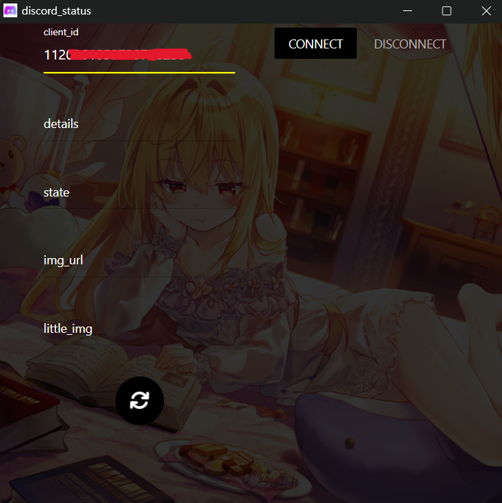

# discord-status

## 更改Discord狀態小程式

## 使用方法:

1. 下載壓縮檔，下載完解壓縮，啟動discord-status.exe
2. 到discord developer註冊一個application，複製APPLICATION ID後填入client_id

3.按下CONNECT後填入其他資訊，兩個img只能填入https的.jpg .png或.gif(圖片不填會跑預設的discord圖示)，之後點點擊下方按紐

3. 更新直接按下方按鈕就好，關閉請記得先按DISCONNECT

### ps.
* 註冊application的名字會成為你個人狀態最上面那一行